Fit the biofilm colonisation area with a stationary solution from the model
================
Andres Diaz,Tatyana Pichugina, Paul Rainey
6/13/2019

Integral area
-------------

Integral area represent sum of the colonized pixel for each frame. Each frame represent one hour of experiment. Here we are interested in 15 first hours.


Integlal area ALI and GALI
--------------------------

We cutted each image to the two parts: ALI part includes 200px (32mkm) layer counted from the ALI, and GLI part includes rest part of the image. The integral area per Strain expreriment is shown below.

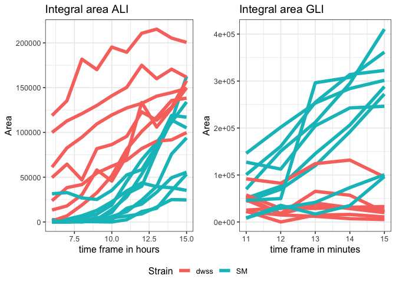

We fitted ALI and GALI separately by Log(Area)~A+B\*frame.

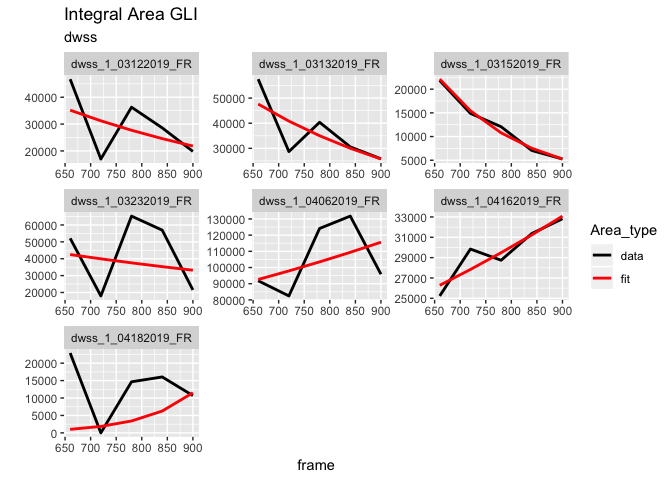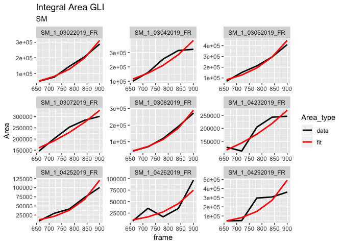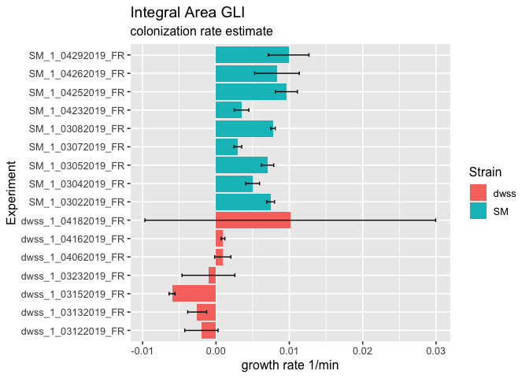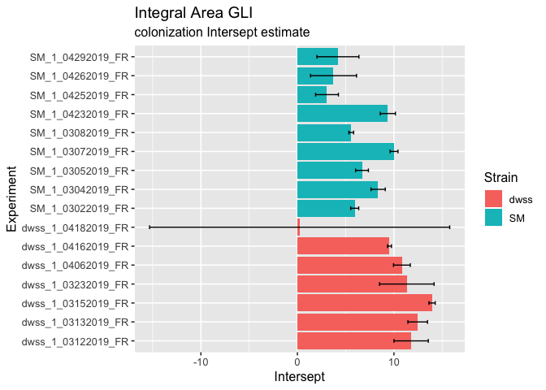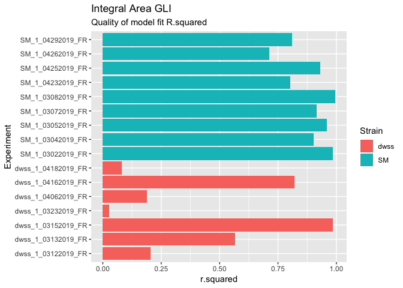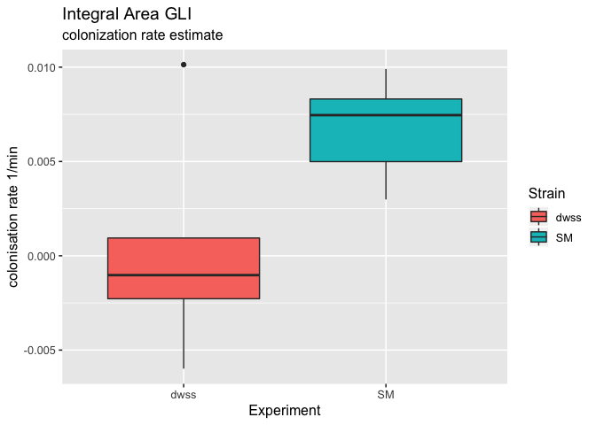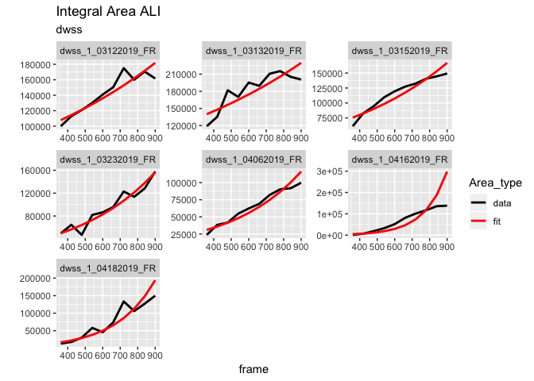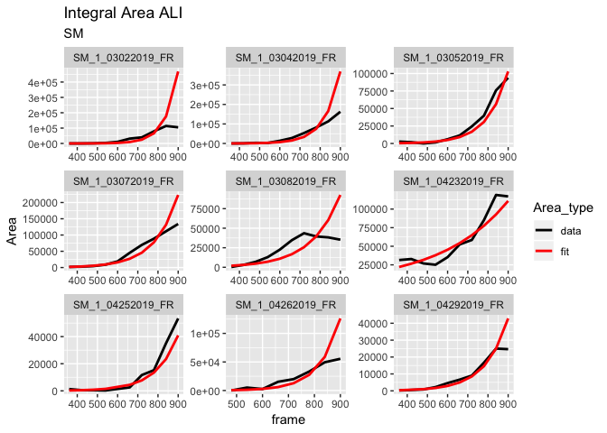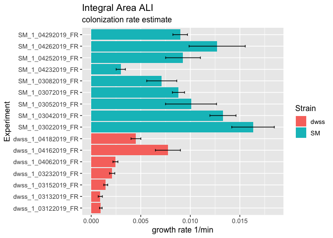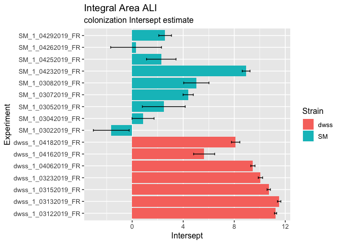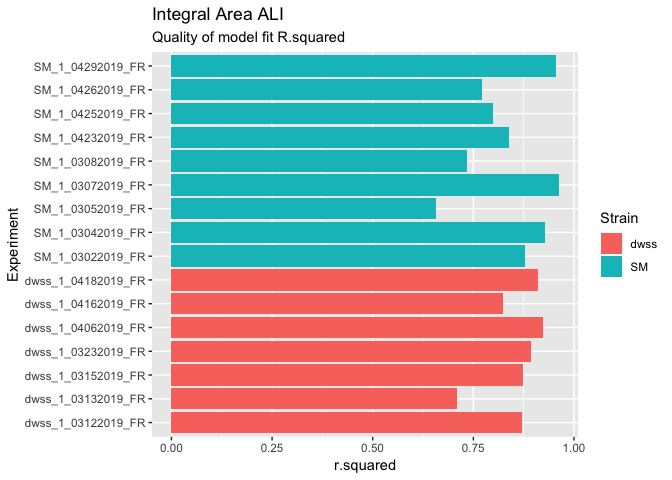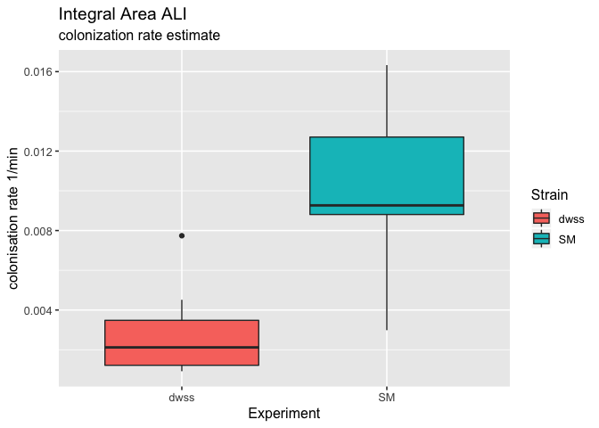

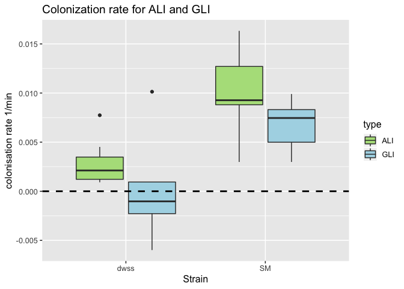 \#\# Colonisation area per Layer

LayerSize=32 mkm (200px)

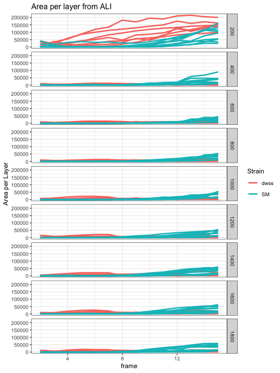 \#\#\# Occupation proportion 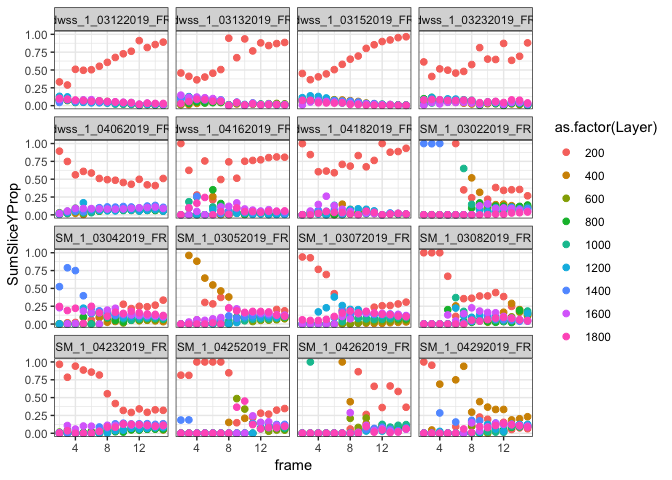

### Colonisation area per Layer

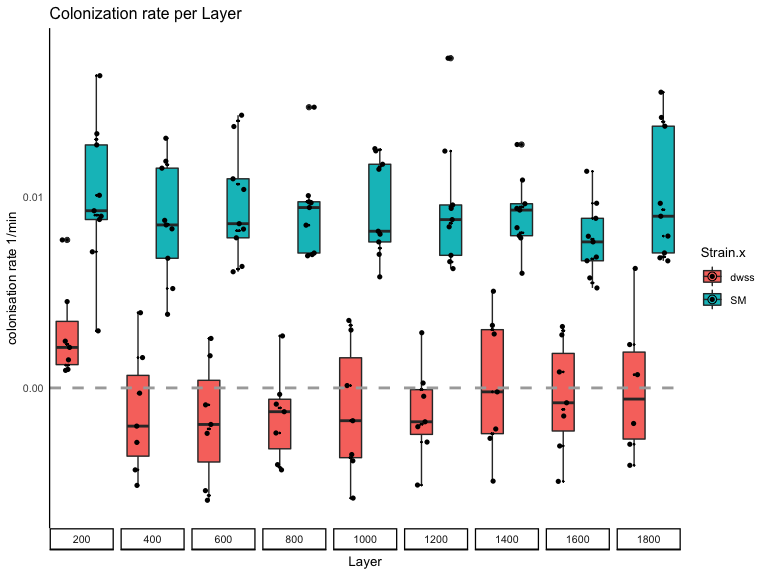

### Quality of the fit: R^2 per experiment

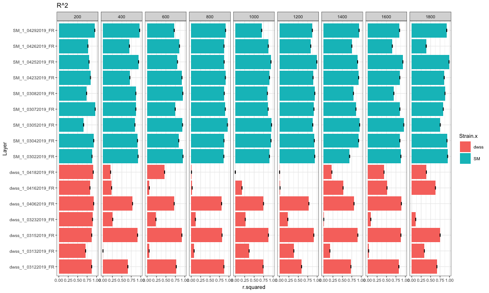 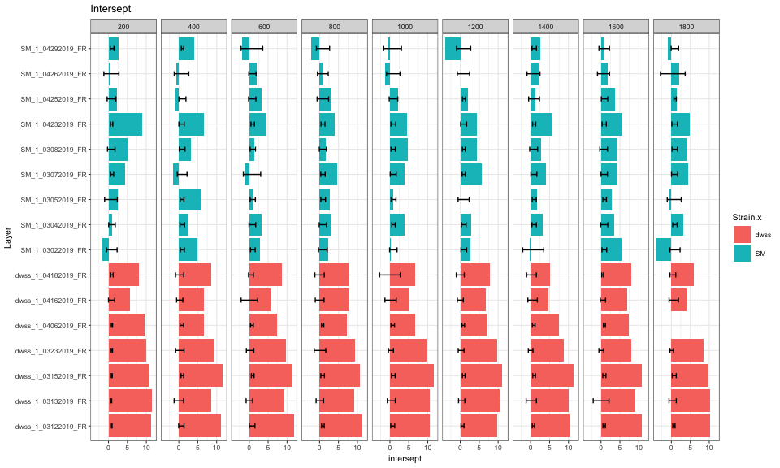

<!-- #### Plot shows ratio  between Area per Layer to total colonization area for different time frames -->
<!-- ```{r,fig.height=14, fig.width=12,echo=FALSE,message=FALSE, warning=FALSE} -->
<!-- AreaTotal<-AreaY %>% group_by(data_stamp,frame,Strain) %>% -->
<!--     summarise(AreaTotal=sum(SumSliceY)) -->
<!-- AreaYSumSliceY<-AreaY %>% select(data_stamp,Strain,Layer,frame,SumSliceY) %>% -->
<!--   inner_join(AreaTotal,by=c("data_stamp","frame","Strain")) %>%  -->
<!--   filter(AreaTotal!=0) %>%  -->
<!--   mutate(Ratio=SumSliceY/AreaTotal)  -->
<!-- AreaYSumSliceY %>% filter(Strain=='dwss') %>% -->
<!--   ggplot(aes(x=Layer,y=Ratio),color=as.numeric(Layer))+geom_bar(size=1,stat="identity",fill="darkblue")+ -->
<!--   scale_x_reverse()+ -->
<!--   coord_flip()+ -->
<!--   facet_grid(frame~data_stamp)+ -->
<!--   ggtitle('dwss ratio')+ -->
<!--   theme_gray(base_size = 10) -->
<!-- AreaYSumSliceY %>% filter(Strain=='SM') %>% -->
<!--   ggplot(aes(x=Layer,y=Ratio),color=as.numeric(Layer))+geom_bar(size=1,stat="identity",fill="darkblue")+ -->
<!--   scale_x_reverse()+ -->
<!--   coord_flip()+ -->
<!--   facet_grid(frame~data_stamp)+ -->
<!--   ggtitle('SM ratio')+ -->
<!--   theme_gray(base_size = 10) -->
<!-- ``` -->
