Fit the biofilm colonisation area with a stationary solution from the model
================
Andres Diaz,Tatyana Pichugina, Paul Rainey
7/02/2019

Total integral area
-------------------

Integral area represent sum of the colonized pixel for each frame. Each frame represent one hour of experiment. Here we are interested in 15 first hours.

 \#\# Total integral area was fitted by Log(Area)~A+B\*time

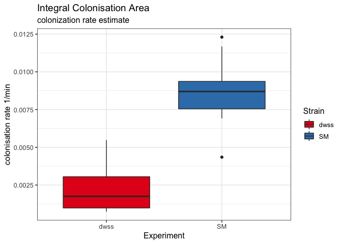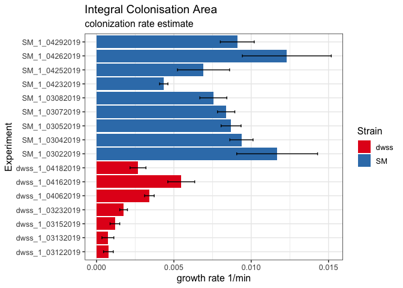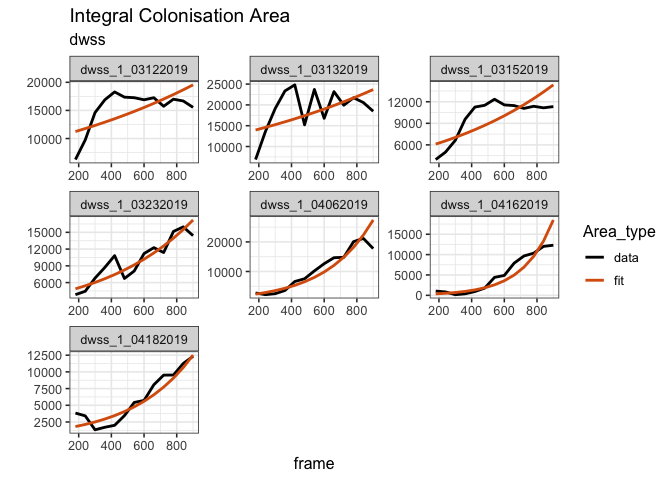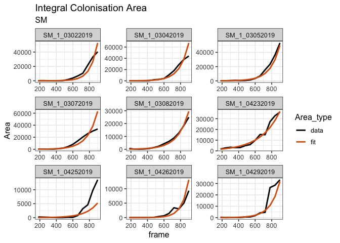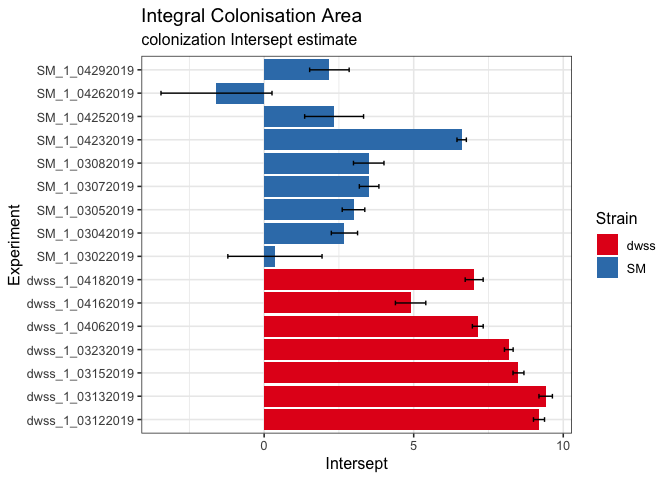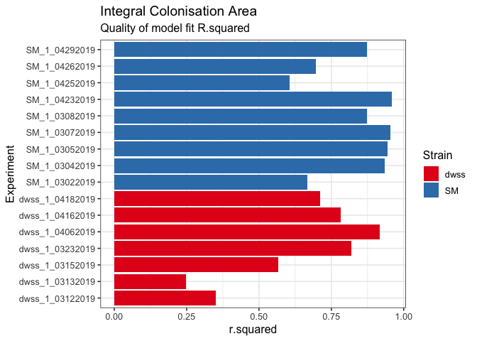

Colonisation area per Layer
---------------------------

LayerSize=64 mkm (400px)

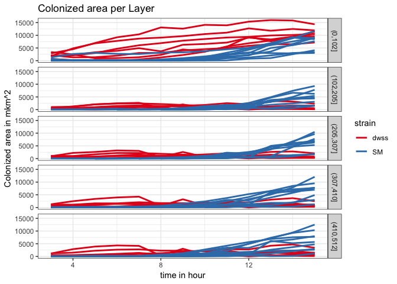 \#\# Linear regression fit separetely for each layer

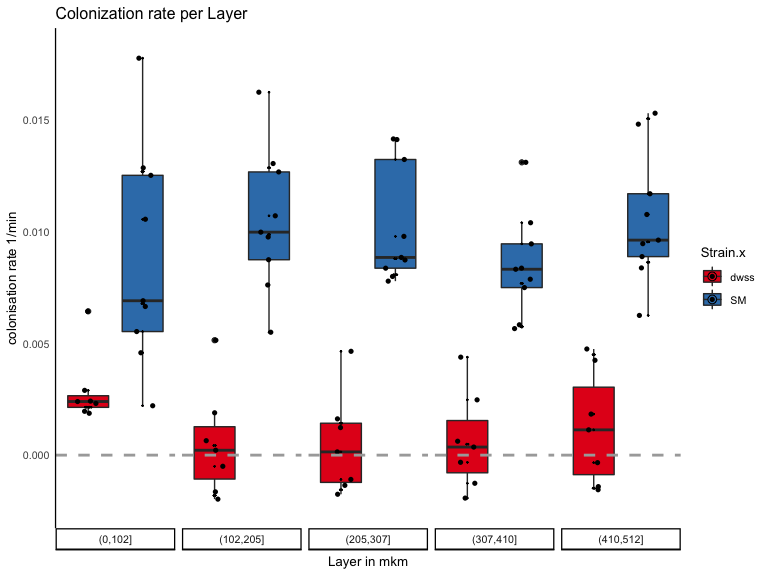 \#\# Quality of the fit per Layer: R^2 per experiment 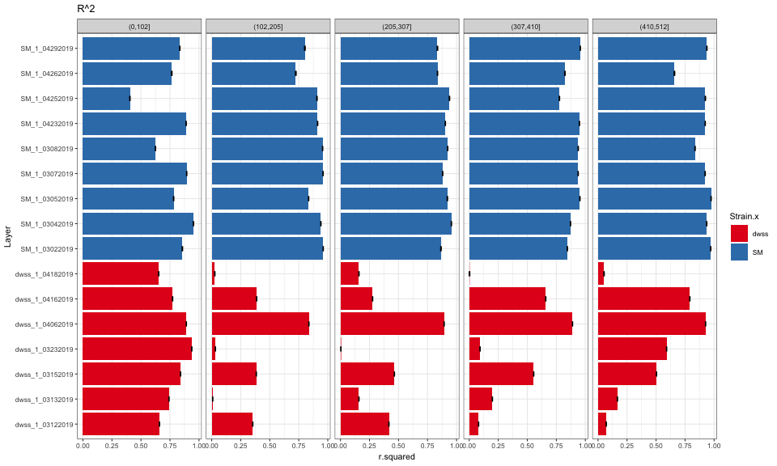 \#\# Quality of the fit per Layer: Intersept per experiment 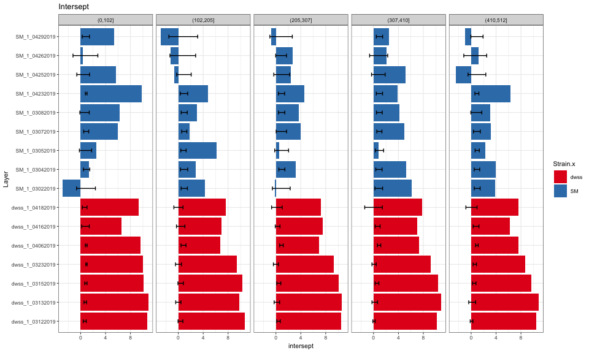 \#\# Occupation proportion per experiment 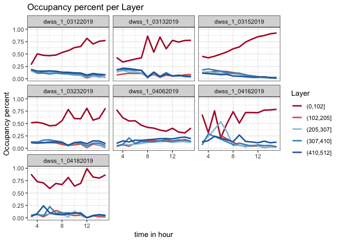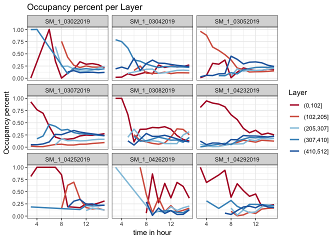
