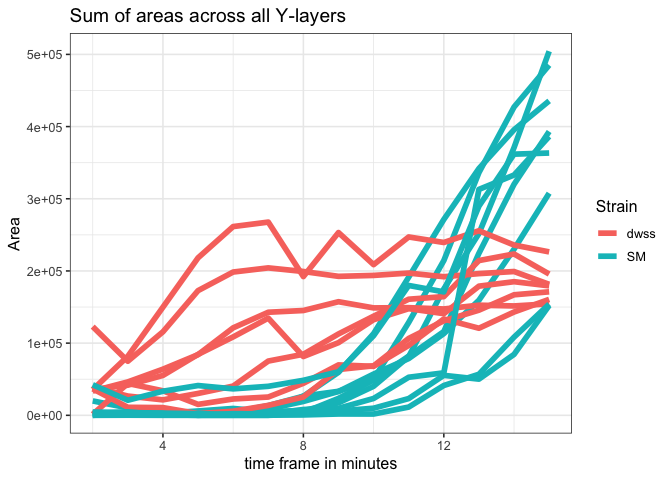
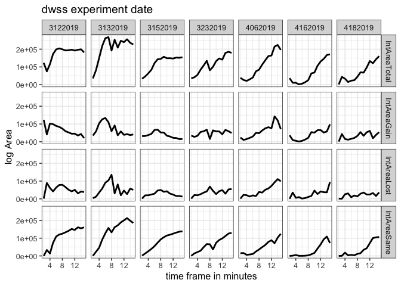
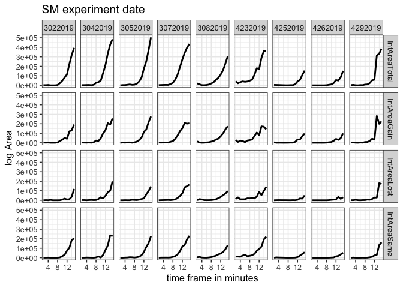
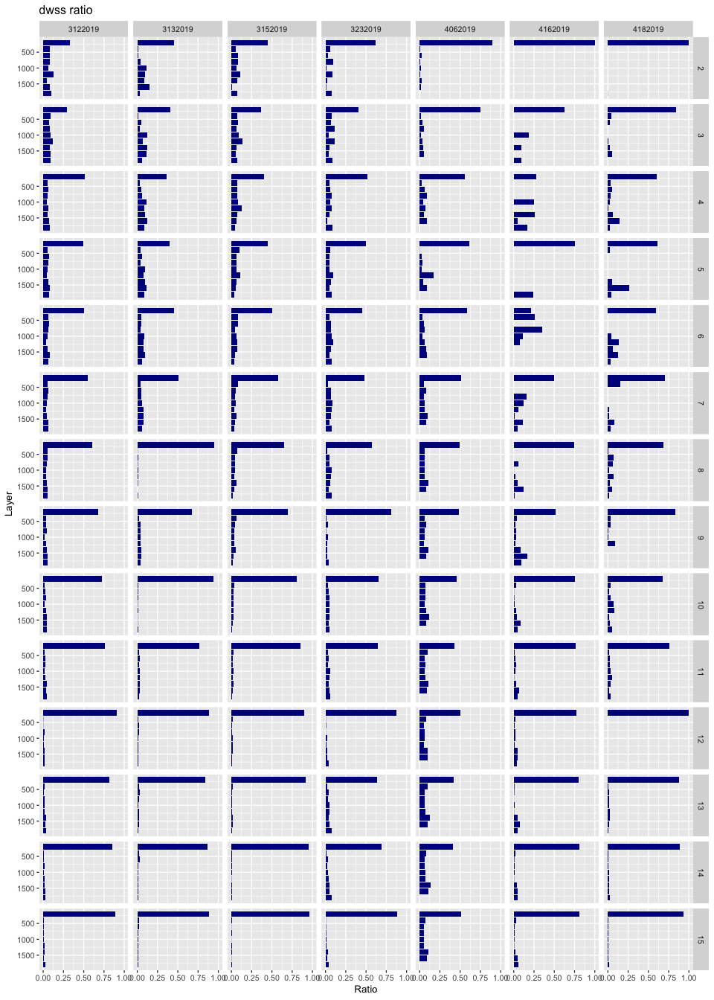
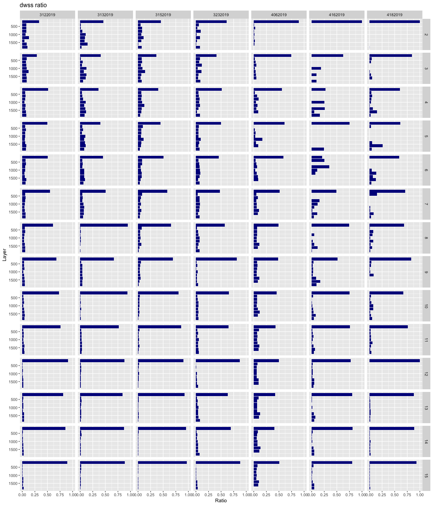
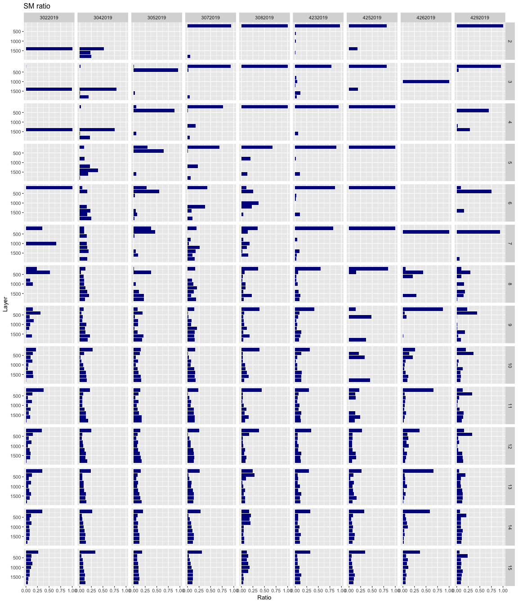

Biofilm colonisation area calculation
================
Tatyana Pichugina
5/13/2019

Integral area
-------------

Integral area represent sum of the colonized pixel for each frame. Each frame represent one hour of experiment. Here we are interested in 15 first hours.

#### Integlal area ALI and GALI

We cutted each image to the two parts: ALI part include 200px (32mkm) layer counted from the ALI, and GALI part include rest part.

#### Gain-Lost-Same summary per experiment

1.  GainTotal represents proportion of pixels that appear new between consecutive frames to the total number occupied pixels.
2.  LostTotal is a proportion of pixels that lost between two consecutive frames to the total number occupied pixels.
3.  SameTotal is a proportion of pixels that stays at the same place between two consecutive frames to the total number occupied pixels.
4.  IntAreaTotal is a total occupied area.

#### dwss sum of colonisation area

#### SM sum of colonisation area

 \#\# Linear regression fit

Colonisation area per Layer
---------------------------

LayerSize=32 mkm (200px)  \#\#\#\# Plot shows ratio between Area per Layer to total colonization area for different time frames  \#\#\#\# Gain-Lost-Same
