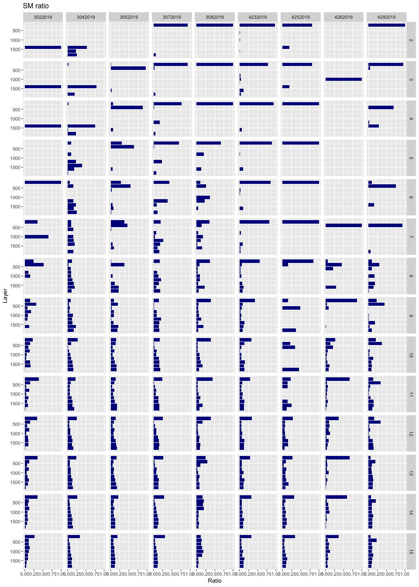

Biofilm colonisation area calculation
================
Tatyana Pichugina
5/13/2019

Integral area
-------------

Sum of the colonize pixel across all data frames.

#### After selection only first 15 frames

#### Gain-Lost-Same summary per experiment

1.  GainTotal represents proportion of pixels that appear new between consecutive frames to the total number occupied pixels.
2.  LostTotal is a proportion of pixels that lost between two consecutive frames to the total number occupied pixels.
3.  SameTotal is a proportion of pixels that stays at the same place between two consecutive frames to the total number occupied pixels.
4.  IntAreaTotal is a total occupied area.

#### dwss sum of colonisation area

#### SM sum of colonisation area

Colonisation area per Layer
---------------------------

LayerSize=32 mkm (200px)  \#\# Plot shows ratio between Area per Layer to total colonization area for different time frames 
