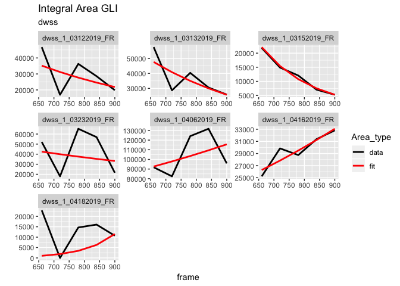
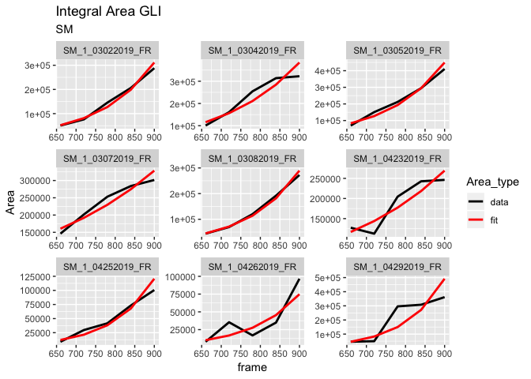
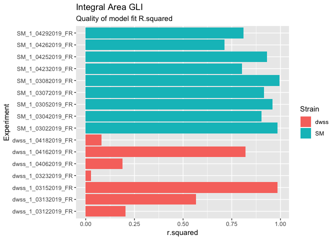
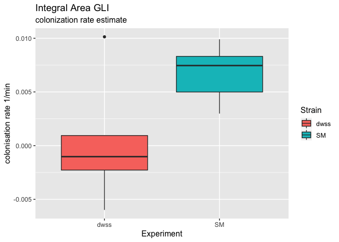
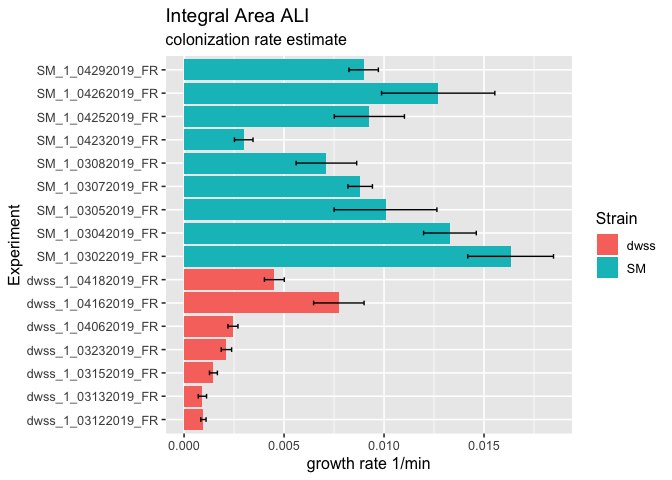
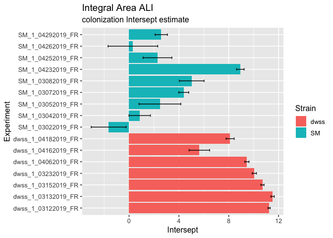
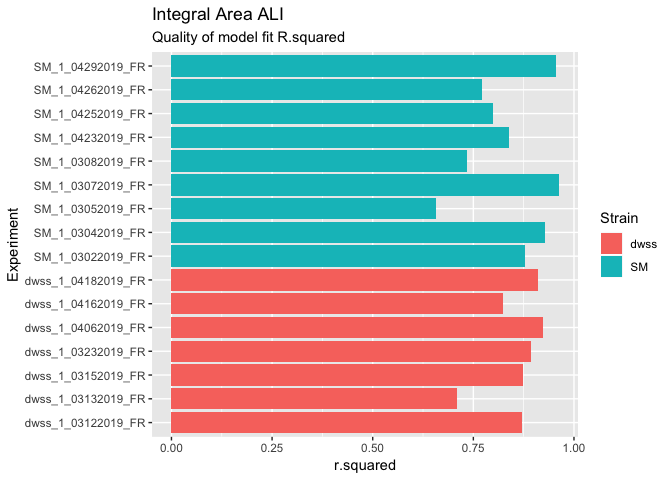
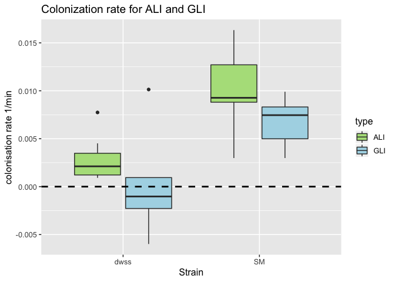

Biofilm colonisation area calculation
================
Andres Diaz,Tatyana Pichugina, Paul Rainey
5/16/2019

Integral area
-------------

Integral area represent sum of the colonized pixel for each frame. Each frame represent one hour of experiment. Here we are interested in 15 first hours.


Integlal area ALI and GALI
--------------------------

We cutted each image to the two parts: ALI part includes 200px (32mkm) layer counted from the ALI, and GLI part includes rest part of the image. The integral area per Strain expreriment is shown below.


We fitted ALI and GALI separately by Log(Area)~A+B\*frame.





<!-- #### Gain-Lost-Same summary per experiment -->
<!-- 1. GainTotal represents proportion of pixels that appear new between consecutive frames to the total number occupied pixels. -->
<!-- 2. LostTotal is a proportion of pixels that lost between two consecutive frames to the total number occupied pixels. -->
<!-- 3. SameTotal is a proportion of pixels that stays at the same place between two consecutive frames to the total number occupied pixels. -->
<!-- 4. IntAreaTotal is a total occupied area. -->
<!-- %#### dwss sum of colonisation area -->
<!-- ```{r eval=FALSE, message=FALSE, warning=FALSE, include=FALSE} -->
<!-- IntegralArea %>% filter(Strain=='dwss') %>% -->
<!--   ggplot(aes(x=frame,y=Area))+ -->
<!--   geom_line(size=1)+ -->
<!--   facet_grid(Area_type~data_stamp,scales="free_y")+ -->
<!--   ggtitle('dwss Sum of areas across all Y-layers ') +  -->
<!--   xlab("time frame in minutes") + ylab("Area") -->
<!-- ``` -->
Colonisation area per Layer
---------------------------

LayerSize=32 mkm (200px)

 <!-- #### Plot shows ratio  between Area per Layer to total colonization area for different time frames --> <!-- ```{r,fig.height=14, fig.width=12,echo=FALSE,message=FALSE, warning=FALSE} --> <!-- AreaTotal<-AreaY %>% group_by(data_stamp,frame,Strain) %>% --> <!--     summarise(AreaTotal=sum(SumSliceY)) -->

<!-- AreaYSumSliceY<-AreaY %>% select(data_stamp,Strain,Layer,frame,SumSliceY) %>% -->
<!--   inner_join(AreaTotal,by=c("data_stamp","frame","Strain")) %>%  -->
<!--   filter(AreaTotal!=0) %>%  -->
<!--   mutate(Ratio=SumSliceY/AreaTotal)  -->
<!-- AreaYSumSliceY %>% filter(Strain=='dwss') %>% -->
<!--   ggplot(aes(x=Layer,y=Ratio),color=as.numeric(Layer))+geom_bar(size=1,stat="identity",fill="darkblue")+ -->
<!--   scale_x_reverse()+ -->
<!--   coord_flip()+ -->
<!--   facet_grid(frame~data_stamp)+ -->
<!--   ggtitle('dwss ratio')+ -->
<!--   theme_gray(base_size = 10) -->
<!-- AreaYSumSliceY %>% filter(Strain=='SM') %>% -->
<!--   ggplot(aes(x=Layer,y=Ratio),color=as.numeric(Layer))+geom_bar(size=1,stat="identity",fill="darkblue")+ -->
<!--   scale_x_reverse()+ -->
<!--   coord_flip()+ -->
<!--   facet_grid(frame~data_stamp)+ -->
<!--   ggtitle('SM ratio')+ -->
<!--   theme_gray(base_size = 10) -->
<!-- ``` -->
